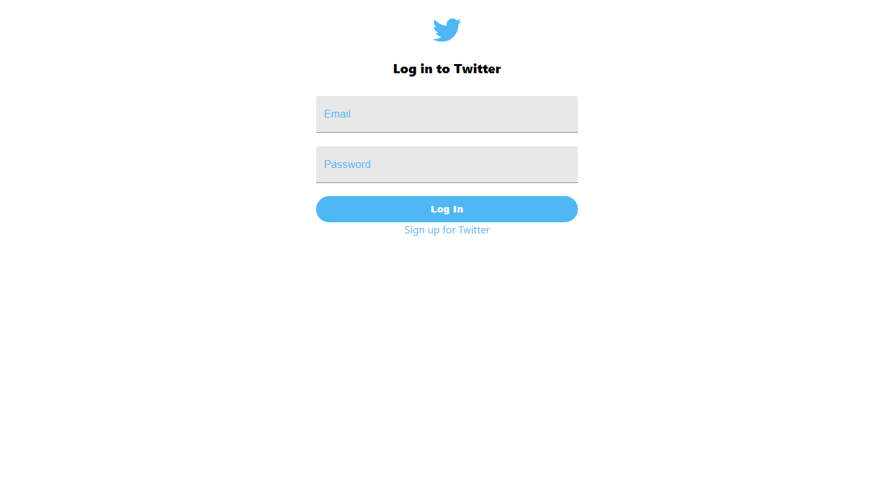
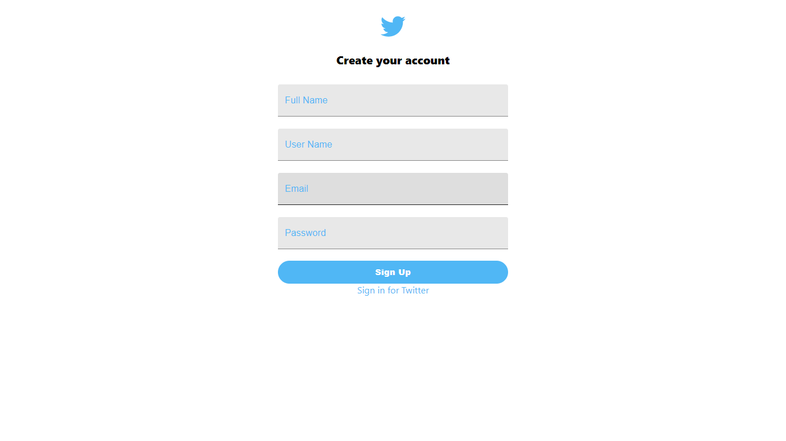
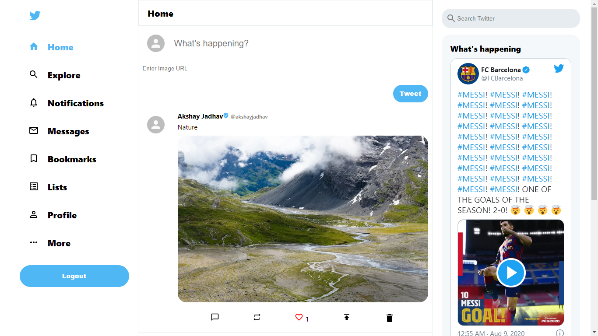

# Twitter clone using firbase

### FlipMove used for animation

### react-twitter-embed used for fetching widgets

basic functionality user can create account,login , tweet ,likes others tweet and delete own tweets.

